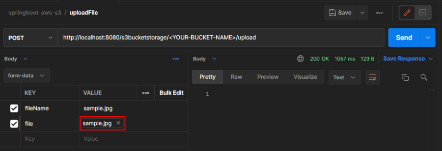
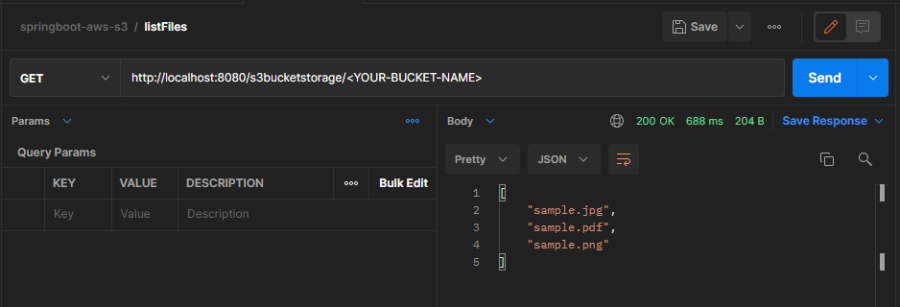
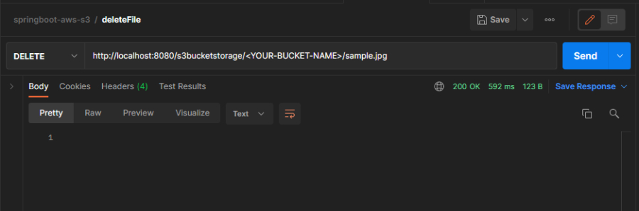
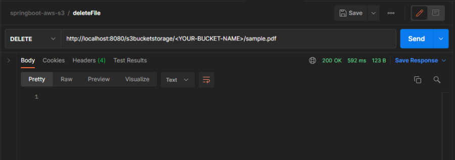
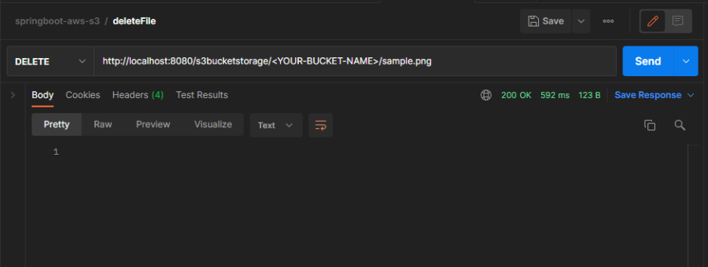

# Spring Boot AWS S3 Application 


## 1. Introduction
Amazon S3 is one of the most popular services from [Amazon Web Services](https://aws.amazon.com/), which provides object storage service that stores data as objects in buckets. An *object* could be any file type which we can attach metadata to describe it, and a *bucket* represents a container for objects.

## 2. Prerequisites
- [Java 8+](https://docs.oracle.com/cd/E19182-01/820-7851/inst_cli_jdk_javahome_t/)
- [Maven 3+](https://maven.apache.org/install.html)
- [AWS Account](https://portal.aws.amazon.com/gp/aws/developer/registration/index.html)
- [AWS Credentials and Region for Development](https://docs.aws.amazon.com/sdk-for-java/v1/developer-guide/setup-credentials.html)
- [S3 Bucket](https://docs.aws.amazon.com/AmazonS3/latest/userguide/creating-bucket.html)
- Your favorite IDE or your loved CLI


## 3. Project Structure
The structure of this sample project is organized by following the MVC (a.k.a. **M**odel **V**iew **C**ontroller) Pattern. You can find more details about this pattern [here](https://examples.javacodegeeks.com/spring-mvc-architecture-overview-example/).

The following are the base folders (packages) in which the project is organized and the purpose of each:
- [📁 application](./src/main/java/br/com/darchanjo/examples/application): contains the main class, annotated with `@SpringBootApplication`, which is responsible for booting up the application
- [📁 config](./src/main/java/br/com/darchanjo/examples/config): contains configuration class, annotated with `@Configuration`, which is responsible for defining the S3 client bean that will be used to perform operations on the bucket
- [📁 controller](./src/main/java/br/com/darchanjo/examples/controller): contains class, annotated with `@Controller`, which is responsible for processing REST requests for access and manipulation of the bucket and its contents
- [📁 enumeration](./src/main/java/br/com/darchanjo/examples/enumeration): contains enum definition for mapping file media type based on known file extensions
- [📁 service](./src/main/java/br/com/darchanjo/examples/service): contains service class, annotated with `@Service`, where all the logic to operate on the bucket is effectively implemented


## 4. Libraries and Dependencies
- [Spring Web](https://docs.spring.io/spring-framework/docs/current/reference/html/web.html)
- [Spring DevTools](https://docs.spring.io/spring-boot/docs/1.5.16.RELEASE/reference/html/using-boot-devtools.html)
- [AWS Java SDK](https://docs.aws.amazon.com/sdk-for-java/latest/developer-guide/home.html)
- [Lombok](https://projectlombok.org/)


## 5. Maven Dependencies
According to the libraries and dependencies declared above, our [pom.xml](./pom.xml) will look like:
```xml
<dependencies>
  <dependency>
    <groupId>org.springframework.boot</groupId>
    <artifactId>spring-boot-starter-web</artifactId>
  </dependency>

  <dependency>
    <groupId>org.springframework.boot</groupId>
    <artifactId>spring-boot-devtools</artifactId>
    <scope>runtime</scope>
    <optional>true</optional>
  </dependency>

  <dependency>
    <groupId>com.amazonaws</groupId>
    <artifactId>aws-java-sdk</artifactId>
    <version>1.12.70</version>
  </dependency>

  <dependency>
    <groupId>org.projectlombok</groupId>
    <artifactId>lombok</artifactId>
    <version>1.18.20</version>
    <scope>provided</scope>
  </dependency>
</dependencies>
```


## 6. S3 Client Definition
The first thing we need to do is define a **S3 client bean** that will be used to operate and access the Amazon S3 web service:
```java
@Configuration
public class AwsS3ClientConfig {

    @Bean
    public AmazonS3 s3Client() {
        return AmazonS3ClientBuilder.standard()
            .withRegion(Regions.US_EAST_1)
            .build();
    }

}
```
Here it is been used the **Default Credential Provider** to instantiate the AWS S3 service client bean. Take a note that to use this type of provider it is necessary that your environment be configured with the access credential and region so that the AWS SDK can be able to detect them when the application makes requests to AWS. For information on how to do this configuration, check  [here](https://docs.aws.amazon.com/sdk-for-java/v1/developer-guide/credentials.html).


## 7. S3 Bucket Operations
### 7.1. Uploading Object
To upload an object into a bucket we use the *putObject()* method from [s3Client](https://docs.aws.amazon.com/AWSJavaSDK/latest/javadoc/com/amazonaws/services/s3/AmazonS3Client.html), which have four available overloaded versions, as per the AWS SDK release being used in this project.

*Note you must have write permissions on the target bucket to add an object to it.*
```java
ObjectMetadata metadata = new ObjectMetadata();
metadata.setContentLength(contentLength);
metadata.setContentType(contentType);

s3Client.putObject(bucketName, keyName, inputStream, metadata);
```
Here we are using the version: [putObject(String bucketName, String key, InputStream input, ObjectMetadata metadata)](https://docs.aws.amazon.com/AWSJavaSDK/latest/javadoc/com/amazonaws/services/s3/AmazonS3Client.html#putObject-java.lang.String-java.lang.String-java.io.InputStream-com.amazonaws.services.s3.model.ObjectMetadata-). 

Notice an instance of [ObjectMetadata](https://docs.aws.amazon.com/AWSJavaSDK/latest/javadoc/com/amazonaws/services/s3/model/ObjectMetadata.html) are being used for attaching the size and type (extension) of the file as metadata so that we can have those details for future reference.


### 7.2. Listing Bucket Objects
To list objects in a bucket we use the *listObjects()* method from [s3Client](https://docs.aws.amazon.com/AWSJavaSDK/latest/javadoc/com/amazonaws/services/s3/AmazonS3Client.html) which have three available overloaded versions, as per the AWS SDK release being used in this project. 

Here we are using the version [listObjects(String bucketName)](https://docs.aws.amazon.com/AWSJavaSDK/latest/javadoc/com/amazonaws/services/s3/AmazonS3Client.html#listObjects-java.lang.String-) which takes the `bucketName` as argument:
```java
ObjectListing objectListing = s3Client.listObjects(bucketName);
```
`listObjects` returns an instace of [ObjectListing](https://docs.aws.amazon.com/AWSJavaSDK/latest/javadoc/com/amazonaws/services/s3/model/ObjectListing.html) which holds a list of [S3ObjectSummary](https://docs.aws.amazon.com/AWSJavaSDK/latest/javadoc/com/amazonaws/services/s3/model/S3ObjectSummary.html) from which we can get informations like [bucketName](https://docs.aws.amazon.com/AWSJavaSDK/latest/javadoc/com/amazonaws/services/s3/model/S3ObjectSummary.html#getBucketName--), [tags](https://docs.aws.amazon.com/AWSJavaSDK/latest/javadoc/com/amazonaws/services/s3/model/S3ObjectSummary.html#getETag--), [keyName](https://docs.aws.amazon.com/AWSJavaSDK/latest/javadoc/com/amazonaws/services/s3/model/S3ObjectSummary.html#getKey--), [last modified date](https://docs.aws.amazon.com/AWSJavaSDK/latest/javadoc/com/amazonaws/services/s3/model/S3ObjectSummary.html#getLastModified--), [owner](https://docs.aws.amazon.com/AWSJavaSDK/latest/javadoc/com/amazonaws/services/s3/model/S3ObjectSummary.html#getOwner--), [object size](https://docs.aws.amazon.com/AWSJavaSDK/latest/javadoc/com/amazonaws/services/s3/model/S3ObjectSummary.html#getSize--) and [storage class](https://docs.aws.amazon.com/AWSJavaSDK/latest/javadoc/com/amazonaws/services/s3/model/S3ObjectSummary.html#getStorageClass--) about every object present in the specified bucket.
```java
objectListing.getObjectSummaries().forEach(o -> {
    log.info("Bucket Name: " + o.getBucketName());
    log.info("ETag: " + o.getETag());
    log.info("Key Name: " + o.getKey());
    log.info("Last Modified Date: " + o.getLastModified());
    log.info("Owner: " + o.getOwner());
    log.info("Object Size: " + o.getSize());
    log.info("Storage Class: " + o.getStorageClass());
});
```

### 7.3. Downloading Object
To download an object from a bucket we use the *getObject()* method from [s3Client](https://docs.aws.amazon.com/AWSJavaSDK/latest/javadoc/com/amazonaws/services/s3/AmazonS3Client.html) which have three available overloaded versions, as per the AWS SDK being used in this project.

Here we are using the version [getObject(String bucketName, String keyName)](https://docs.aws.amazon.com/AWSJavaSDK/latest/javadoc/com/amazonaws/services/s3/AmazonS3Client.html#getObject-java.lang.String-java.lang.String-) which takes the target `bucketName` and `keyName` as argument, and returns an [S3Object](https://docs.aws.amazon.com/AWSJavaSDK/latest/javadoc/com/amazonaws/services/s3/model/S3Object.html) object.
```java
S3Object s3Object = s3Client.getObject(bucketName, keyName);
```

Once we get an S3Object instance we use the [getObjectContent()](https://docs.aws.amazon.com/AWSJavaSDK/latest/javadoc/com/amazonaws/services/s3/model/S3Object.html#getObjectContent--) method from it for getting the inputstream containing the contents of the object.
```java
InputStream inputStream = s3Object.getObjectContent();
```

And with the inputstream representing the content of the object at hands, we should convert it into a byte array so that we can be able to add it to the response body:
```java
ByteArrayOutputStream outputStream = new ByteArrayOutputStream();
int len;
byte[] buffer = new byte[4096];
while ((len = inputStream.read(buffer, 0, buffer.length)) != -1) {
    outputStream.write(buffer, 0, len);
}
```

Assuming we request to download the file `sample.pdf`, the controller's [ResponseEntity](https://docs.spring.io/spring-framework/docs/current/javadoc-api/org/springframework/http/ResponseEntity.html) returning object after processing will be constructed like this:
```java
return ResponseEntity.ok()
  .header("Content-Disposition", "attachment; filename=sample.pdf")
  .contentType("application/pdf")
  .body(outputStream.toByteArray());
```


### 7.4. Deleting Object
To delete an object from a bucket we use the *deleteObject()* method from [s3Client](https://docs.aws.amazon.com/AWSJavaSDK/latest/javadoc/com/amazonaws/services/s3/AmazonS3Client.html) which have two available overloaded versions, as per the AWS SDK being used in this project.

Here we are using the version [deleteObject(String bucketName, String key)](https://docs.aws.amazon.com/AWSJavaSDK/latest/javadoc/com/amazonaws/services/s3/AmazonS3Client.html#deleteObject-java.lang.String-java.lang.String-) which takes the target `bucketName` and `keyName` as argument.
```java
s3Client.deleteObject(bucketName, keyName);
```


## 8. Testing`
### 8.1. Bootstraping the Application
For simplicity, I prefer to use the command line on trying something new quickly, but it's up to you if you want to load the project into your favorite IDE. 😉🤓
<ol>
<li>Clone the repository:</li>
  <code>$ git clone https://github.com/davidarchanjo/spring-boot-aws-s3</code>
<li>Navigate to the folder:</li>
  <code>$ cd spring-boot-aws-s3</code>
<li>Run the application:</li>
  <code>$ mvn spring-boot:run</code>
</ol>

### 8.2. Uploading Object
POST `/s3bucketstorage/{bucketName}/upload`



### 8.3. Listing Objects
GET `/s3bucketstorage/{bucketName}`


### 8.4. Downloading Object
GET `/s3bucketstorage/{bucketName}/download/{fileName}`


### 8.5. Deleting Object
DELETE `/s3bucketstorage/{bucketName}/{fileName}`




#### Listing bucket after delete all objects


## 9. Conclusion
My goal was to demonstrate those basic operations when dealing programmatically with a file storage service like Amazon S3 from a Spring Boot application. 
Hope you enjoyed and have learned a little something!

Happy learning and coding!